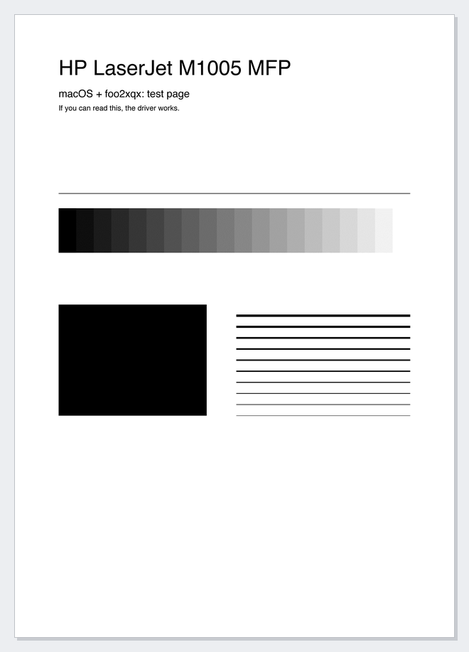

<div align="center">

# HP LaserJet M1005 MFP для macOS

**Драйвер печати для современных Mac — Apple Silicon (M1–M4) и Intel. Установка одной командой.**

[](https://github.com/iMironRU/hp-m1005-macos/actions/workflows/ci.yml)
[](LICENSE)


[Установка](#установка) · [Меню](#меню) · [Как это работает](#как-это-работает) · [Если что-то не так](#если-что-то-не-так) · [English](#english)

</div>

HP не выпускает драйвер M1005 для новых версий macOS. Этот скрипт собирает на вашем Mac
открытый драйвер **foo2xqx** из проекта [OpenPrinting/foo2zjs](https://github.com/OpenPrinting/foo2zjs)
и подключает его к системе печати. Принтер после этого работает из любого приложения, как обычный.

- **Одна команда.** Скрипт сам поставит всё нужное, включая Command Line Tools.
- **Один файл.** Всё лежит в [`install.sh`](install.sh): исходник фильтра, PPD и тестовая страница.
- **Ничего лишнего.** Не нужны Ghostscript, Homebrew и Rosetta. SIP и песочница CUPS не затрагиваются.

## Установка

Включите принтер, подключите его по USB, откройте **Терминал** и вставьте:

```bash
curl -fsSL https://raw.githubusercontent.com/iMironRU/hp-m1005-macos/main/install.sh | bash
```

Выберите **1** — скрипт спросит пароль администратора и сделает всё остальное:

1. при необходимости установит Command Line Tools (тихо через `softwareupdate`, если не выйдет — откроет стандартное окно и дождётся);
2. скачает foo2zjs (зафиксированный коммит) и соберёт `foo2xqx` под ваш процессор;
3. соберёт фильтр `rastertoxqx` и установит его вместе с PPD;
4. найдёт принтер на USB, создаст принтер «HP LaserJet M1005 MFP» и напечатает тестовую страницу.

<p align="center"></p>

## Меню

```
HP LaserJet M1005 MFP — драйвер для macOS
  1) Установить (всё необходимое + принтер + тестовая страница)
  2) Установить без тестовой страницы
  3) Напечатать тестовую страницу
  4) Состояние
  5) Сделать принтером по умолчанию
  6) Отменить все задания в очереди
  7) Удалить драйвер и принтер
  8) Диагностика (тест + подробный журнал в файл)
  0) Выход
```

Без меню — параметр после `-s --`:

```bash
curl -fsSL https://raw.githubusercontent.com/iMironRU/hp-m1005-macos/main/install.sh | bash -s -- --install
```

| Параметр | Действие |
|---|---|
| `--install` | установить всё |
| `--install --no-test` | установить без тестовой страницы |
| `--test` | напечатать тестовую страницу |
| `--status` | показать состояние |
| `--default` | сделать принтером по умолчанию |
| `--clear` | отменить все задания |
| `--diag` | диагностика, отчёт на Рабочий стол |
| `--uninstall` | удалить драйвер и принтер |

## Как это работает


Растеризацию делает сама macOS. Фильтр `rastertoxqx` переводит серое изображение в чёрно-белое
(дизеринг Флойда–Стейнберга) и ставит его на своё место на листе. `foo2xqx` упаковывает страницу
в формат XQX, который понимает принтер, — с теми же параметрами, что и штатный драйвер foo2zjs в Linux.

### Что ставится

| Файл | Куда |
|---|---|
| `foo2xqx` — собирается из foo2zjs @ [`80499ed`](https://github.com/OpenPrinting/foo2zjs/commit/80499ed5bf6caa2963ad337e37cfda78a80aab1e) | `/Library/Printers/foo2xqx/Filter/` |
| `rastertoxqx` — собирается из исходника внутри скрипта | `/Library/Printers/foo2xqx/Filter/` |
| `HP-LaserJet-M1005-MFP-foo2xqx.ppd` | `/Library/Printers/PPDs/Contents/Resources/` |

Пункт **7** удаляет всё это вместе с принтером.

### Настройки в диалоге печати

| Настройка | Значения |
|---|---|
| Размер бумаги | A4, Letter, Legal, Executive, A5 |
| Разрешение | 1200×600 (по умолчанию), 600×600 |
| Плотность тонера | 1 (светлее) – 5 (темнее), по умолчанию 3 |

## Если что-то не так

| Проблема | Что делать |
|---|---|
| «Принтер на USB не найден» | Включите принтер, подключите кабель напрямую, без хаба, и запустите команду ещё раз. |
| Печатает не то или пустой лист | Пункт **8 «Диагностика»**. Отчёт `m1005-diag.txt` появится на Рабочем столе — приложите его к [issue](https://github.com/iMironRU/hp-m1005-macos/issues). |
| В списке два принтера M1005 | macOS могла сама создать принтер при подключении. Выбирайте «HP LaserJet M1005 MFP», лишний удалите в «Настройках → Принтеры и сканеры». |
| Предупреждение «Printer drivers are deprecated» | Это сообщение CUPS о драйверах PPD в целом, на работу не влияет. |

**Ограничения:** только печать — сканер M1005 не поддерживается.

## Разработка

Сквозной тест собирает всю цепочку и проверяет, что рисунок тестовой страницы стоит на листе
с точностью до пикселя. Принтер для этого не нужен:

```bash
tests/pipeline.sh
```

Тест запускается в [GitHub Actions](.github/workflows/ci.yml) на Apple Silicon и Intel.

## English

**HP LaserJet M1005 MFP printer driver for modern macOS (Apple Silicon & Intel).**
Builds the open-source `foo2xqx` driver from [OpenPrinting/foo2zjs](https://github.com/OpenPrinting/foo2zjs)
and plugs it into CUPS using macOS's native PDF rasterizer — no Ghostscript, Homebrew or Rosetta.
Plug the printer in via USB and run:

```bash
curl -fsSL https://raw.githubusercontent.com/iMironRU/hp-m1005-macos/main/install.sh | bash
```

Choose **1** in the menu. Printing only; the scanner is not supported. The UI is in Russian.

## Лицензия

[GPLv2](LICENSE), как и [foo2zjs](https://github.com/OpenPrinting/foo2zjs) — спасибо автору foo2zjs Рику Ричардсону и OpenPrinting.
